<div align="center">


<br />

[](https://python.org)
[](https://nextjs.org)
[](https://fastapi.tiangolo.com)
[](https://eclipse.dev/sumo/)
[](https://carla.org)
[](https://github.com/ultralytics/ultralytics)
[](https://bau.edu.tr)
[](https://github.com/3bdulah/ai-traffic-management-system/actions/workflows/ci.yml)

**Traffic lights that see the road and adapt to it in real time.** Instead of running on a fixed timer, this system uses AI-powered cameras to count vehicles as they arrive and adjusts signal timing on the fly — tested in a virtual city across three traffic patterns and proven to cut waiting times by up to **54 %**.

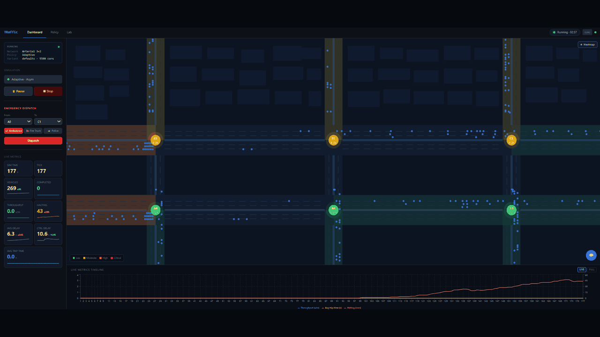

</div>

---

## At a glance

<table>
<tr>
<td align="center" width="25%">

### **40–54 %**

shorter average wait per car across three demand profiles

</td>
<td align="center" width="25%">

### **0.949**

YOLOv11m mAP50 across 7 vehicle classes including emergency vehicles

</td>
<td align="center" width="25%">

### **27.7 FPS**

real-time inference on a consumer-grade laptop GPU

</td>
<td align="center" width="25%">

### **$2.50**

total cloud-GPU training cost — fully open-source stack

</td>
</tr>
</table>

---

## The problem

Urban traffic signal control sits at the intersection of three persistent gaps:

- **Fixed-time signals are blind to real demand.** Pre-computed schedules waste green time on empty approaches and starve congested ones whenever observed conditions deviate from historical averages.
- **Camera-driven adaptive control isn't deployable on commodity hardware.** Existing platforms either rely on inductive loops (expensive to install, no classification) or research systems that need bespoke compute.
- **Reproducible policy comparison is rare.** Most published adaptive-control work is hard to reproduce end-to-end, making cross-study comparisons unreliable.

This project's answer: a single integrated stack — microsimulation, custom YOLOv11m perception, adaptive signal control, and a unified dashboard — built entirely on open-source tools, evaluated through a fixed-seed race-mode framework, and validated end-to-end on a **$2.50** cloud-GPU budget.

---

## Project objectives (delivered)

| # | Objective | Status |
|---|---|---|
| 1  | SUMO-based microsimulation of a 3×2 arterial grid with three configurable demand profiles | ✅ |
| 2  | Adaptive signal control policy driven by per-lane queue measurements | ✅ |
| 3  | Emergency vehicle preemption supporting dashboard dispatch and corridor clearing | ✅ |
| 4  | YOLOv11m computer-vision pipeline across 7 vehicle classes including emergency types | ✅ |
| 5  | Traffic analytics: speed estimation, queue counting, violation detection, collision detection | ✅ |
| 6  | Unified real-time web dashboard with policy tuning, emergency dispatch, and AI assistant | ✅ |
| 7  | Reproducible race-mode policy comparison across three demand profiles | ✅ |
| 8  | Supabase persistence for tick-level data, experiments, and policy variants | ✅ |
| 9  | Quantitative performance evaluation across detection, tracking, throughput, and inference speed | ✅ |
| 10 | Closed-loop ramp metering on a 3 km freeway corridor with 4 metered ramps | ✅ |
| 11 | Combined city + highway network with a CompositePolicy abstraction | ✅ |
| 12 | Simulation Lab page consolidating comparison authoring, results, and per-run drill-down | ✅ |

**9 proposal objectives + 3 added during execution** — CARLA visualization bridge, emergency preemption, and Groq AI assistant — all delivered.

---

## Architecture

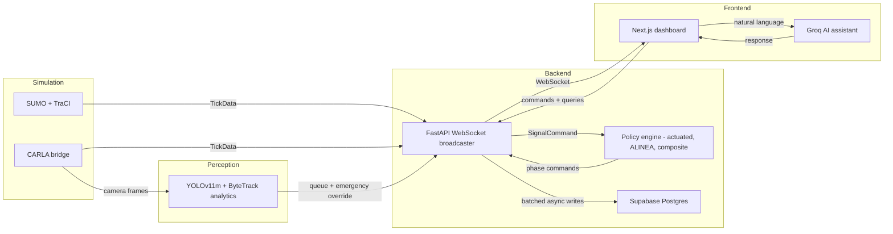

---

## Why this stack

The four most consequential technical choices, and what we picked over.

<table>
<tr><th align="left">Decision</th><th align="left">Chose</th><th align="left">Considered</th><th align="left">Reason</th></tr>
<tr>
<td><b>Microsimulation engine</b></td>
<td>SUMO 1.26 (TraCI)</td>
<td>Aimsun · CityFlow</td>
<td>Open-source, mature TraCI Python API for closed-loop control, comparable to existing literature.</td>
</tr>
<tr>
<td><b>Object detector</b></td>
<td>YOLOv11m fine-tuned on synthetic data</td>
<td>YOLOE · VideoMT · YOLOv12 off-the-shelf</td>
<td>Off-the-shelf models could not distinguish police cars from passenger vehicles; custom training resolved the gap.</td>
</tr>
<tr>
<td><b>Multi-object tracker</b></td>
<td>ByteTrack</td>
<td>DeepSORT · SORT</td>
<td>Appearance-free design removes the re-identification dependency; robust to lighting variation.</td>
</tr>
<tr>
<td><b>Training data source</b></td>
<td>CARLA synthetic (12,064 images, 13 weather presets)</td>
<td>Real-world municipal CCTV · public datasets</td>
<td>Municipal footage was inaccessible; public imagery had severe class imbalance. Synthetic gave full control of class distribution and lighting.</td>
</tr>
</table>

---

## Tech stack

| Layer | Technology |
|---|---|
| Simulation | SUMO 1.26 (TraCI) · CARLA 0.9.16 (optional) |
| Detection | YOLOv11m fine-tuned on a 12,064-image CARLA synthetic dataset |
| Tracking | ByteTrack via Ultralytics |
| Analytics | OpenCV · 4-point homography · per-frame speed / queue / violations |
| Backend | FastAPI · Uvicorn · WebSocket · Pydantic |
| Frontend | Next.js 14 · React 18 · Zustand · Recharts · Tailwind CSS |
| Persistence | Supabase Postgres · batched async bulk inserts |
| AI assistant | Groq API (Llama 3.3 70B) |

---

## The networks

<table>
<tr>
<td align="center" width="33%">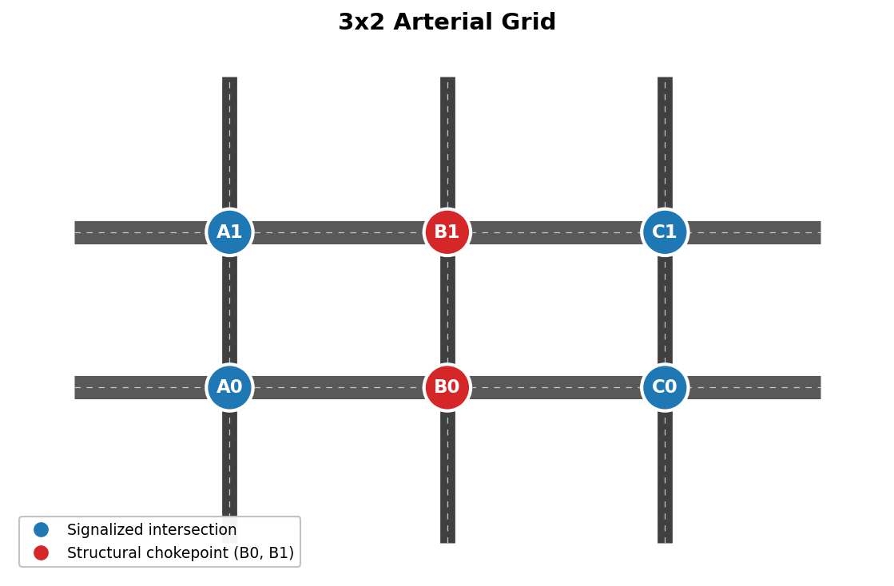</td>
<td align="center" width="33%">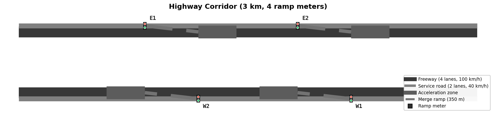</td>
<td align="center" width="33%">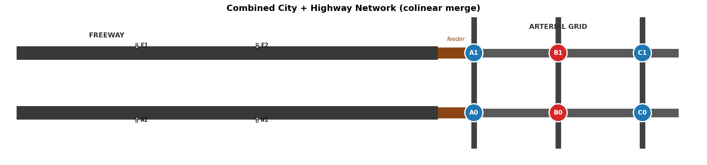</td>
</tr>
<tr>
<td align="center"><b>3×2 arterial grid</b><br /><sub>6 signalized intersections; B0/B1 chokepoint highlighted</sub></td>
<td align="center"><b>Highway corridor</b><br /><sub>3 km dual-carriageway, 4 ramp meters with ALINEA control</sub></td>
<td align="center"><b>Combined network</b><br /><sub>Freeway feeds the arterial grid through a colinear merge</sub></td>
</tr>
</table>

---

## Three demand profiles

Race-mode evaluation runs the same network with each policy across three deliberately different demand patterns, all on a fixed seed for reproducibility.

<table>
<tr>
<td align="center" width="33%" valign="top">

### Balanced

**40 % / 40 % / 20 %**
<sub>E-W · N-S · turns</sub>

Symmetric demand — the worst fit for the fixed-time plan's E-W bias, the **largest** improvement for the adaptive policy.

**−54 %** shorter waits

</td>
<td align="center" width="33%" valign="top">

### Asymmetric

**56 % / 24 % / 20 %**
<sub>E-W · N-S · turns</sub>

70 : 30 directional split favouring east-west — the typical urban arterial pattern.

**−48 %** shorter waits

</td>
<td align="center" width="33%" valign="top">

### Extreme

**75 % / 10 % / 15 %**
<sub>E-W · N-S · turns</sub>

Severe E-W bias. The fixed-time plan is closest to optimal here — adaptive gain narrows.

**−40 %** shorter waits

</td>
</tr>
</table>

<div align="center">
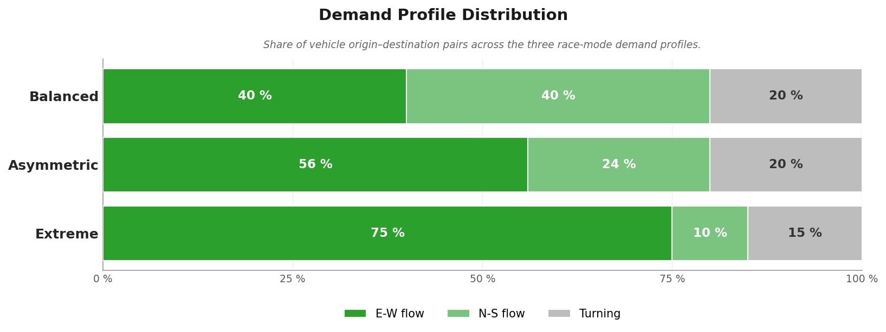
</div>

---

## Safety & priority

The platform doesn't just optimize for throughput — two safety mechanisms intervene when the adaptive policy alone isn't enough.

<table>
<tr>
<td width="50%" valign="top">

### 🚨 Emergency vehicle preemption

When an emergency vehicle is dispatched from the dashboard, a preemption module takes over from the adaptive policy:

1. The vehicle's position and target intersection are registered through TraCI.
2. The module computes the upstream sequence of intersections along its route.
3. At each one, the approach phase is **held green** until the vehicle clears.
4. Control returns to the active policy once the corridor is clear.

The preemption corridor is broadcast in every TickData snapshot, so operators see exactly which intersections are being held in real time.

</td>
<td width="50%" valign="top">

### 🛑 Collision detection

Every frame from a watched camera passes through the YOLOv11m + ByteTrack analytics layer, which continuously checks for **collision events** using bounding-box overlap and ground-plane proximity within a configurable threshold.

Detected incidents are:
- **Logged** with timestamp, intersection, and tracked vehicle IDs to the per-session JSON/CSV files
- **Surfaced** on the dashboard map as incident markers
- **Available** as a signal-side input for incident-aware phase decisions — the same perception channel that drives the live queue and emergency overrides

</td>
</tr>
</table>

> **The closed loop in one sentence:** perception flows into the same TickData stream as simulator state, so the adaptive policy can react to a queue, an emergency dispatch, or a detected collision through the same control interface.

---

## Perception in action

The same YOLOv11m + ByteTrack analytics pipeline runs identically whether the input is a CARLA-rendered camera feed or a real traffic camera. Two examples below show the analytics layer working on real-world footage — chevron-violation zones, ramp-entry counts, and collision detection — against video the model never saw in training.

<table>
<tr>
<td align="center" width="50%">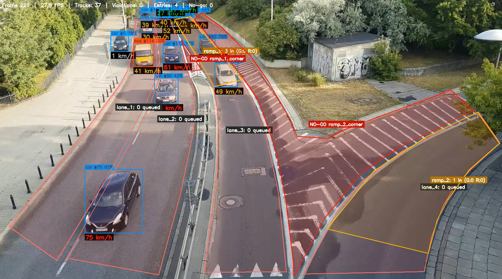</td>
<td align="center" width="50%">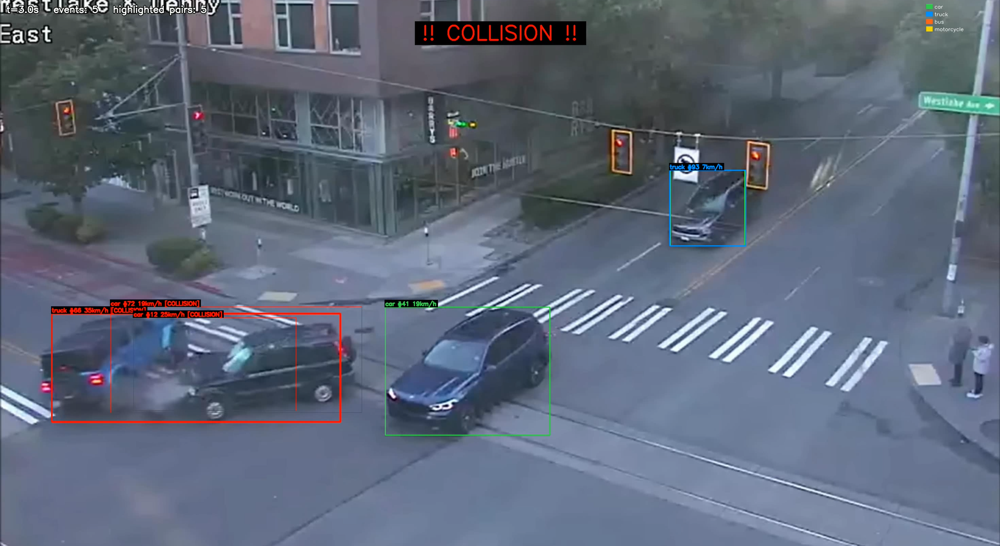</td>
</tr>
<tr>
<td align="center"><b>Real-world ramp camera</b><br /><sub>Chevron <code>NO-GO</code> zones, ramp entry counts, per-lane queue tallies, and per-vehicle speed labels — all overlaid live</sub></td>
<td align="center"><b>Live collision detection</b><br /><sub>Vehicles within the proximity threshold flagged <code>[COLLISION]</code> and boxed red; events logged to disk and surfaced on the dashboard</sub></td>
</tr>
</table>

> **Why this matters:** the YOLOv11m model was trained entirely on CARLA-generated synthetic data, never on real traffic footage. These frames are the strongest visual evidence that the synthetic-to-real domain gap is bridgeable in this setting — the same code path that powers the simulation analytics works on a real camera with no model changes.

---

## Results

<table>
<tr>
<td align="center" width="50%">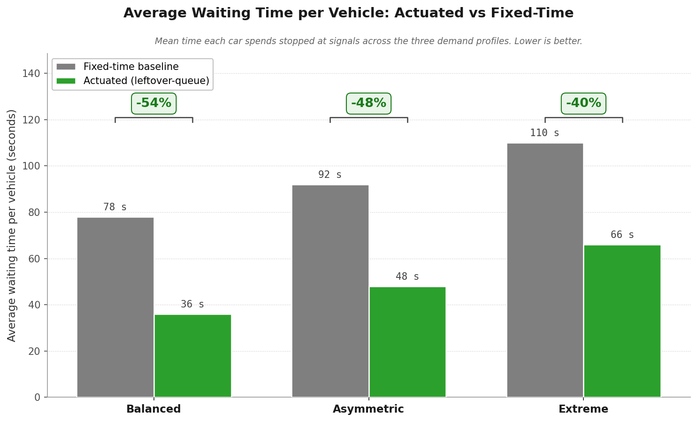</td>
<td align="center" width="50%">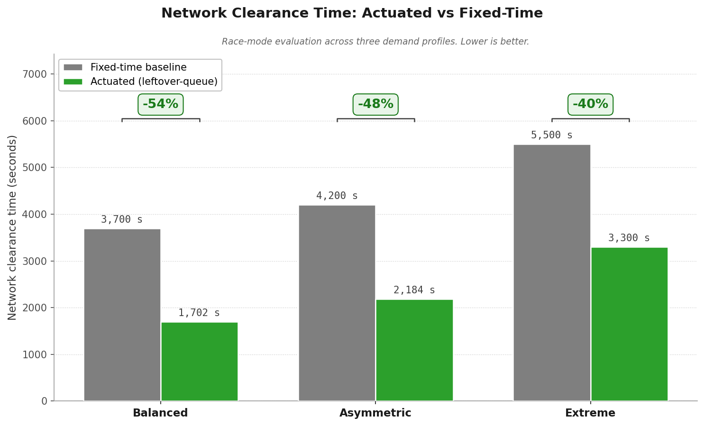</td>
</tr>
<tr>
<td align="center"><b>Average waiting time per vehicle</b><br /><sub>Mean time each driver spends stopped at signals — the <b>headline number</b></sub></td>
<td align="center"><b>Network clearance time</b><br /><sub>How long it takes to empty the entire network — measures throughput</sub></td>
</tr>
</table>

<br />

<table>
<tr>
<td align="center" width="50%">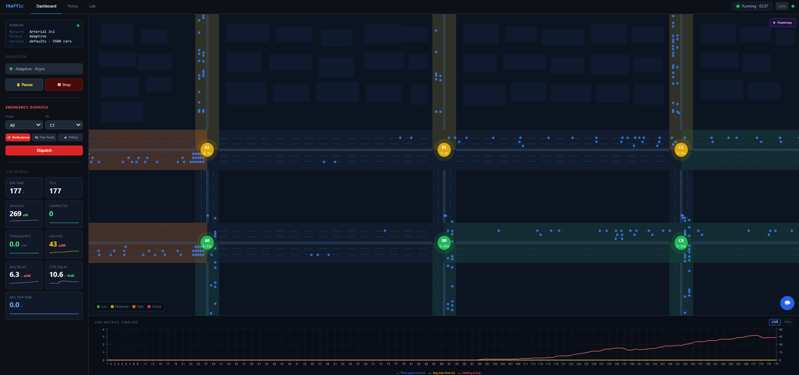</td>
<td align="center" width="50%">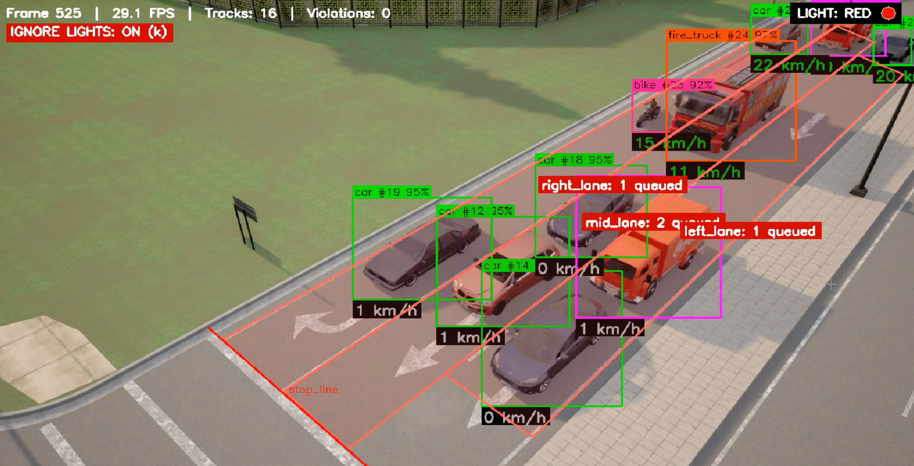</td>
</tr>
<tr>
<td align="center"><b>Live dashboard</b><br /><sub>3×2 grid map, live tick metrics, emergency dispatch, heatmap overlay, embedded AI assistant</sub></td>
<td align="center"><b>CARLA mode + vision overlay</b><br /><sub>Per-frame detection with per-lane queue counts, light state, and an "Ignore lights" toggle for stress testing</sub></td>
</tr>
</table>

<br />

<div align="center">
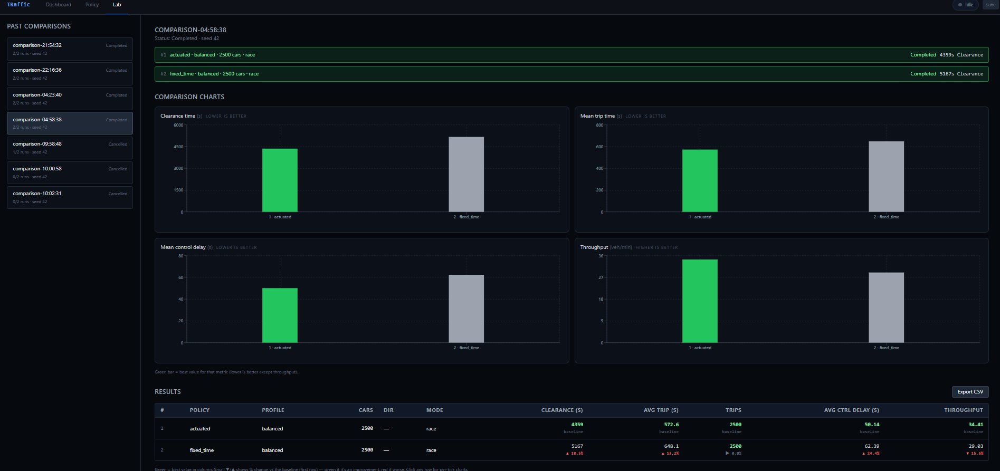
<br />
<b>Simulation Lab — side-by-side policy comparison</b><br />
<sub>Past comparisons rail · selected run summary with seed and clearance · 2×2 grid of bar charts (clearance, mean trip time, control delay, throughput) · full results table with percentage deltas vs the baseline · per-row drill-down into per-tick charts · CSV export</sub>
</div>

---

## Testing & validation

The system was validated at three levels — unit tests on each controller and detector primitive, integration tests on the full SimulationManager + CV pipeline, and operator-workflow system tests through the dashboard.

> **CI:** GitHub Actions runs automated unit tests for the ALINEA and composite policy controllers on every push. Tests T-01–T-05 and T-08–T-10 are experimental / integration validations documented in [`docs/CAPSTONE_REPORT.md`](docs/CAPSTONE_REPORT.md); T-06–T-07 are reproduced via `scripts/run_races.py`.

<details>
<summary><b>10 test cases — all passed</b></summary>

<br />

| ID | Test | Result |
|---|---|---|
| T-01 | YOLOv11m detection accuracy on held-out CARLA test | mAP50 = 0.949 |
| T-02 | Emergency-vehicle classification (ambulance / police / fire) | All three classified as distinct; bus recall 96 % |
| T-03 | Multi-object tracking (ByteTrack) | MOTA 0.78, IDF1 0.88, 47 ID switches across 47,014 detections |
| T-04 | Analytics pipeline on a recording | Speed, queue, violations all logged to CSV + JSON |
| T-05 | Vision-to-control integration (CARLA hybrid override) | Watched intersection driven by vision; others by ground truth |
| T-06 | Actuated vs fixed-time across 3 demand profiles in race mode | 40 % / 48 % / 54 % shorter average waits per car |
| T-07 | Race-mode framework reproducibility under fixed seed | Identical results across all 6 profile × policy runs |
| T-08 | Emergency vehicle preemption end-to-end | Corridor cleared across 5 dispatch tests |
| T-09 | Ramp-metering controller end-to-end on highway corridor | Closed-loop behaviour and safety override verified |
| T-10 | Composite policy on combined network | Both child controllers dispatched correctly |

</details>

<details>
<summary><b>6 success criteria — all met</b></summary>

<br />

| ID | Target | Achieved |
|---|---|---|
| SC-1 | Detection mAP50 ≥ 0.85 | **0.949** |
| SC-2 | Real-time throughput ≥ 20 FPS | **27.7 FPS** |
| SC-3 | Emergency-vehicle classification | Ambulance, police, and fire classified |
| SC-4 | Tracking quality MOTA ≥ 0.70 | **0.78** |
| SC-5 | Average waiting time reduction ≥ 20 % on balanced profile | **54 %** balanced · **48 %** asym · **40 %** extreme |
| SC-6 | All 6 races complete without manual intervention | Reliable after SimulationManager teardown fix |

</details>

---

## Key findings

What the integrated build revealed — beyond the headline metrics.

<table>
<tr>
<td width="50%" valign="top">

### 🎯 The B0 / B1 chokepoint is structural

Per-intersection queue telemetry identified a persistent build-up at the network's central east-west corridor that the actuated policy cannot resolve regardless of parameter tuning. The constraint is geometric — the intersection physically cannot clear enough vehicles per cycle. Treated as a methodological finding (motivates network-level coordination as future work), not a system failure.

</td>
<td width="50%" valign="top">

### 👁️ Vision can drive control on rendered cameras

The most technically ambitious deliverable: in CARLA mode the watched intersection's queue and emergency state are sourced from the YOLOv11m + ByteTrack analytics, while every other intersection continues to use simulator ground truth. The hybrid override is the essential step toward a deployment where no ground truth exists.

</td>
</tr>
<tr>
<td width="50%" valign="top">

### 🚌 Bus recall: 7.9 % → 96 %

Initial training produced 7.9 % bus recall — severe minority-class underperformance. Doubling the bus spawn ratio in the CARLA capture script alone — **no model change, no extra training** — recovered recall to 96 %. Dataset balance dominates model capacity for minority-class problems.

</td>
<td width="50%" valign="top">

### 🏁 Race-mode reproducibility is enforced, not assumed

Initial 6-race batches crashed on the second run due to orphaned TraCI socket handles. Enforcing a strict SimulationManager teardown sequence (TraCI disconnect → SUMO subprocess termination → file handle closure) made every race independently reproducible. All parameters and outcomes are logged to Supabase for verification without re-running.

</td>
</tr>
</table>

---

## Project structure

```
ai-traffic-management-system/
├── backend/                 FastAPI app — routers, services, WebSocket manager
├── frontend/                Next.js dashboard — components, hooks, Zustand store
├── packages/
│   ├── adaptive-policy/     Signal control policies (actuated · fixed-time · ALINEA · composite)
│   ├── carla-bridge/        CARLA client, traffic manager, camera sensors, vision manager
│   ├── cv-pipeline/         YOLOv11m + ByteTrack + per-camera analyzer
│   ├── shared/              Pydantic models, constants, config (shared across all packages)
│   └── sumo-engine/         TraCI client, snapshot extraction, three network configs
├── scripts/                 Network + demand generation, race-mode runners
├── supabase/                Database migrations
└── docs/                    Capstone report, demo guide, README assets
```

---

## Demonstrable workflows

<details>
<summary><b>🏁 Run a race-mode evaluation across three demand profiles</b></summary>

```bash
python scripts/run_races.py
```

Launches six races (3 profiles × 2 policies), each from identical seeded initial conditions. Results stream to Supabase and appear in the dashboard's Simulation Lab page with side-by-side bar charts and per-row drill-down into per-tick metric histories.

</details>

<details>
<summary><b>🔀 Switch signal policy live without restarting the simulation</b></summary>

1. Start a simulation from the dashboard.
2. Navigate to **`/policy`**.
3. Edit any of the eight actuated policy parameters (`base_green_n/s/e/w`, `min_green`, `max_green`, `max_redist_s`, `smooth_alpha`) and save as a named variant.
4. From the sidebar variant picker, select the new variant — the running simulation switches mid-run.

</details>

<details>
<summary><b>👁️ Toggle the vision overlay on a camera in CARLA mode</b></summary>

1. Start the platform with CARLA running on `localhost:2000` and select **mode = CARLA** in the simulation controls.
2. Click any intersection on the map, open the **Cameras** tab, and pick an approach (N, E, S, or W).
3. Click **Vision: on** — the feed annotates with bounding boxes, class labels, per-vehicle speeds, and emergency markers, and that intersection's queue and emergency state on the map are sourced from the vision pipeline. Every other intersection continues to use simulator ground truth.

</details>

<details>
<summary><b>🚨 Dispatch an emergency vehicle through the priority corridor</b></summary>

1. Open the **Emergency** panel from the dashboard sidebar.
2. Pick a vehicle type and a target intersection.
3. Click **Dispatch** — the preemption module computes the upstream phase sequence and holds the approach green until the vehicle clears.

</details>

<details>
<summary><b>🧪 Regenerate the network and demand files</b></summary>

```bash
python scripts/generate_network.py
```

Rewrites `arterial.rou.xml` from the active demand profile. Race configs (`race_{profile}.sumocfg` → `arterial_{profile}.rou.xml`) regenerate alongside.

</details>

---

## Future work

Six directions, each motivated directly by what this build revealed.

1. **Real-camera deployment via domain adaptation.** The analytics pipeline was designed for retrofit (4-point homography needs no specialized hardware). A small labelled real-world dataset fine-tuned on top of the CARLA weights would close the synthetic-to-real gap.

2. **Multi-camera fusion for occlusion robustness.** ByteTrack's ID switches concentrate at extended occlusions by larger vehicles and frame-boundary re-entries — both addressable with multi-view fusion.

3. **Reinforcement-learning policy comparison.** Train a deep RL agent in the existing SUMO environment and compare against the rule-based leftover-queue policy on the same race-mode framework.

4. **Spillback-aware policy variants for B0 / B1.** Beyond timing adjustments — anticipate downstream queue build-up before it spills back upstream.

5. **License plate recognition and re-identification.** Natural extensions for enforcement and origin-destination analysis, with privacy safeguards designed in from the start.

6. **AI assistant historical-data access.** The Groq assistant currently sees only the live tick. Extending it to past experiment runs ("which profile had the worst chokepoint?") would significantly increase operational value.

---

## Conclusions

<div align="center">

<table>
<tr>
<td align="center" width="33%"><h2>40–54 %</h2><sub>shorter average wait per car</sub></td>
<td align="center" width="33%"><h2>0.949</h2><sub>YOLOv11m mAP50</sub></td>
<td align="center" width="33%"><h2>12 / 12</h2><sub>objectives delivered</sub></td>
</tr>
</table>

</div>

A complete integrated stack — microsimulation, custom perception, adaptive control, and a unified dashboard — delivered on a **$2.50** cloud-GPU budget. Every controller, every experiment outcome, and every policy variant is logged to a Supabase Postgres database, making the full system reproducible from a single `git clone`.

---

## Quick start

### Prerequisites

- Python **3.9+** (3.12 recommended to match the CARLA wheel)
- Node.js **18+** and npm
- [SUMO 1.26.0](https://eclipse.dev/sumo/) with `SUMO_HOME` env var set
- *(Optional)* [CARLA 0.9.16](https://carla.org/) for the photorealistic bridge

### Install

```bash
git clone https://github.com/3bdulah/ai-traffic-management-system.git
cd ai-traffic-management-system

# Backend
python -m venv .venv
.venv/Scripts/activate            # Windows
# source .venv/bin/activate       # macOS / Linux
python -m pip install -e packages/shared -e packages/sumo-engine \
                      -e packages/adaptive-policy -e packages/cv-pipeline \
                      -e packages/carla-bridge -e backend
python -m pip install ultralytics

# Frontend
cd frontend && npm install && cd ..
```

### Run

**macOS / Linux**

```bash
source .venv/bin/activate
python -m uvicorn backend.main:app --host 127.0.0.1 --port 8000
# new terminal:
cd frontend && npm run dev
```

**Windows**

```bash
.venv\Scripts\activate
python -m uvicorn backend.main:app --host 127.0.0.1 --port 8000
# new terminal:
cd frontend && npm run dev
```

Open **http://localhost:3000**, pick a network and a policy, and click **Start**.

> Supabase and Groq are optional — the dashboard runs without them; persistence and the AI assistant need keys in `.env` (see `.env.example`).

---

## Reference

The complete capstone report — including methodology, full results, analysis, and acknowledgements — lives in [`docs/CAPSTONE_REPORT.md`](docs/CAPSTONE_REPORT.md). Team credits are in [`CONTRIBUTORS.md`](CONTRIBUTORS.md). First-time setup without cloud keys: [`docs/DEMO.md`](docs/DEMO.md). Regenerate schematic and chart figures with `bash scripts/generate_readme_figures.sh`; the demo GIF with `python docs/images/scripts/make_demo_gif.py`.

---

<div align="center">
<sub>Built for the AI Engineering capstone at <a href="https://bau.edu.tr">Bahçeşehir University</a>, Istanbul — June 2026.</sub>
</div>
