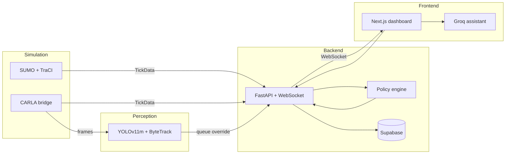

# Architecture

High-level design of the integrated platform. See [README](README.md) for results and setup.

## Data flow

## Package responsibilities

| Package | Role |
|---------|------|
| `sumo-engine` | TraCI client, network snapshots, emergency routing |
| `adaptive-policy` | Actuated, fixed-time, ALINEA, composite controllers |
| `cv-pipeline` | Detection, tracking, per-camera analytics |
| `carla-bridge` | CARLA world sync, cameras, vision manager |
| `shared` | Pydantic types, config, Supabase client |
| `backend` | REST + WebSocket API, simulation orchestration |
| `frontend` | Operator dashboard and experiment UI |

## Runtime modes

| Mode | Simulation | Perception source |
|------|------------|-------------------|
| SUMO | TraCI ground truth | N/A (optional CV on recordings) |
| CARLA | Co-sim with SUMO | Ground truth + optional vision override on watched camera |

## API surface

- **REST:** `http://localhost:8000/api` — simulation, signals, metrics, policy variants, experiments
- **OpenAPI:** `http://localhost:8000/docs` (Swagger UI when backend is running)
- **WebSocket:** `ws://localhost:8000/ws/traffic` — live `TickData` stream

## Persistence

Supabase Postgres stores runs, per-tick metrics, policy variants, and comparison experiments. The backend batches writes asynchronously so the simulation loop never blocks on network I/O.

## Related work

Computer vision training pipeline and dataset capture: [OJayyusiO/dataset_capstone](https://github.com/OJayyusiO/dataset_capstone)
